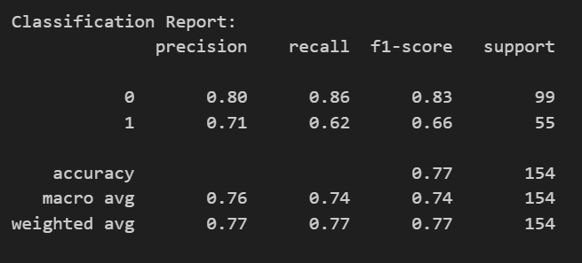
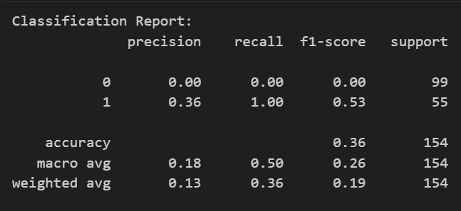

# Tugas 3 Pembelajaran Mesin - Membandingkan kasus Klasifikasi menggunakan ANN dan SVM

Diberikan referensi sebagai berikut: 
- https://www.megabagus.id/deep-learning-artificial-neural-networks/ (halaman 1 - 7)
- ⁠⁠https://www.megabagus.id/deep-learning-artificial-neural-networks-aplikasi (halaman 1 - 4)
 

### Menjalankan source code nn.ipynb :
1. Menginstal Python dan semua library yang dibutuhkan (terdapat di dalam file nn_diabetes.ipynb).
2. Jalankan source code pada lingkungan Python
3. Dataset diambil dari Kaggle yaitu dataset Diabetes (https://www.kaggle.com/datasets/pushprajnamdev/diabetes-dataset).  

### Membandingkan kasus Klasifikasi menggunakan SVM dan ANN:
- Akurasi model menggunakan SVM: 0.77

- Akurasi model menggunakan ANN: 0.36

### Kesimpulan 
Berdasarkan proses yang telah dilakukan dalam melakukan cleaning data, EDA sampai membuat prediksi menggunakan model SVM dan ANN, didapatkan hasil prediksi yang lebih akurat menggunakan model SVM. Hal ini dapat terjadi karena dataset tidak terlalu kompleks atau besar sehingga lebih cocok digunakan model SVM sedangkan ketika dataset menggunakan model ANN, terjadi overfitting karena dataset yang terlalu kecil. Namun hasil akurasi model menggunakan ANN ini juga dapat terjadi karena jumlah layer yang digunakan masih sangat kurang sehingga mungkin model ANN ini dapat memberikan hasil yang lebih baik jika layer yang digunakan ditambahkan lebih banyak lagi.  